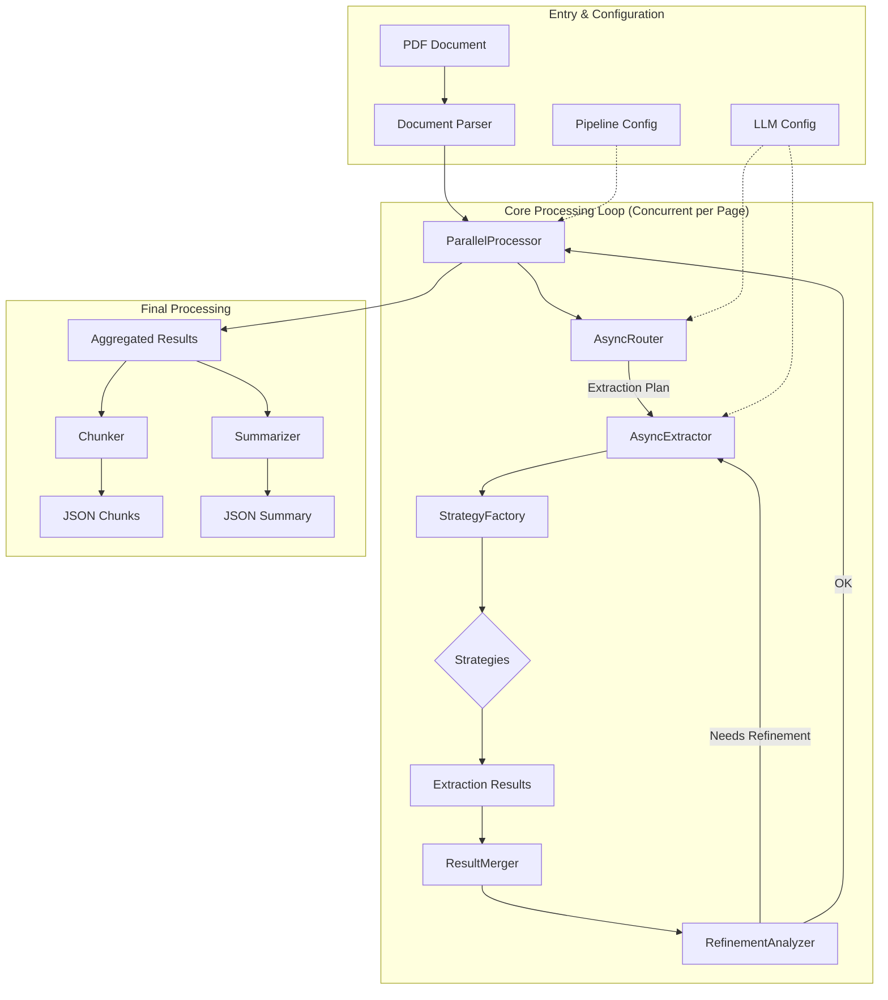

# Architecture Overview

This document provides a detailed overview of the Intelligent Document Extraction Pipeline's architecture. The system is designed for modularity, extensibility, and high performance, leveraging an async-first approach.

## Guiding Principles

- **Modularity:** Each component has a single, well-defined responsibility, promoting separation of concerns.
- **Extensibility:** The system is built around a pluggable strategy pattern, making it easy to add new extraction capabilities or support new document formats.
- **Scalability:** The pipeline is built with `asyncio` to handle large documents and high throughput by processing pages concurrently.
- **Resilience:** The system includes multiple layers of fault tolerance, including automatic retries, model fallbacks, and graceful error handling.

## Architectural Layers & Core Components

The pipeline is organized into several logical layers, each containing specific components:

### 1. Orchestration Layer
This is the entry point and central coordinator of the pipeline.

- **`PipelineOrchestrator`**: Wires together all other components. It initiates the document processing flow, manages the concurrent execution of summarization and chunking, and aggregates the final results.

### 2. Configuration Layer
This layer manages all static and dynamic configuration for the pipeline, ensuring type safety and easy management.

- **`PipelineConfig`**: A Pydantic model defining high-level settings like concurrency limits and feature flags.
- **`llm_config.yaml`**: A human-readable YAML file for configuring all LLM models, API endpoints, and fallback chains. This is loaded into type-safe Pydantic models.
- **`prompt_templates.py`**: A centralized repository for all LLM prompt templates, allowing for easy modification and versioning.

### 3. Core Processing Layer
This layer contains the main logic for analyzing pages and extracting data.

- **`AsyncRouter`**: The "brain" of the pipeline. It uses a vision-capable LLM to analyze each page, assess its complexity, identify content types (text, tables, charts), and create a tailored, step-by-step extraction plan.
- **`AsyncExtractor`**: Executes the extraction plan generated by the router. It calls the appropriate strategy for each step.
- **`ResultMerger`**: A component responsible for intelligently consolidating the results from different extraction steps, especially during refinement.

### 4. Processing & Concurrency Layer
This layer handles the parallel execution and post-processing of the extracted data.

- **`ParallelProcessor`**: Manages the concurrent processing of multiple document pages. It orchestrates the router-extractor-merger sequence for each page, dramatically reducing end-to-end processing time.
- **`Chunker`**: Splits the extracted content into smaller, semantically coherent chunks suitable for downstream tasks like RAG.
- **`Summarizer`**: Generates a high-level executive summary of the entire document from the extracted results.

### 5. Strategy Layer
This layer implements the different extraction strategies using a **pluggable strategy pattern**. A `StrategyFactory` selects the appropriate strategy based on the extraction plan.

- **`MinimalStrategy`**: For quick, high-level data extraction.
- **`BasicStrategy`**: A balanced approach for common extraction tasks.
- **`ComprehensiveStrategy`**: For detailed, in-depth analysis.
- **`VisualStrategy`**: Focuses on charts, graphs, and other visual elements.
- **`TableFocusedStrategy`**: Specialized for high-accuracy table extraction.

### 6. Resilience Layer
This layer provides robust patterns for handling failures and ensuring smooth operation.

- **`RetryHandler`**: Automatically retries failed API calls with exponential backoff.
- **`FallbackChain`**: If a primary LLM fails, the system automatically falls back to a chain of secondary models.
- **`TokenLimitHandler`**: Gracefully manages token limit errors to prevent catastrophic failures.
- **`RateLimiter`**: A token bucket implementation to prevent API rate limit errors from the LLM provider.

## Data Flow Diagram

The following diagram illustrates the data flow through the pipeline:

## Detailed Workflow

1.  A PDF document is passed to the **`PipelineOrchestrator`**.
2.  The orchestrator initializes the **`ParallelProcessor`**, which splits the document into individual pages.
3.  For each page (processed in parallel):
    a. The **`AsyncRouter`** analyzes the page image and generates a multi-step `ExtractionPlan`.
    b. The **`AsyncExtractor`** receives the plan and, for each step, uses the `StrategyFactory` to invoke the correct extraction strategy (e.g., `TableFocusedStrategy`).
    c. If refinement is enabled, the **`RefinementAnalyzer`** inspects the results. If it detects a missed table, for example, it can trigger a new extraction step.
    d. The **`ResultMerger`** consolidates the data from all steps into a single JSON object for the page.
4.  Once all pages are processed, the `Orchestrator` receives the aggregated extraction results.
5.  The `Orchestrator` then concurrently calls:
    a. The **`Chunker`** to split the extracted content into smaller chunks.
    b. The **`Summarizer`** to generate an executive summary of the document.
6.  The final output (extraction results, chunks, and summary) is saved as JSON files.